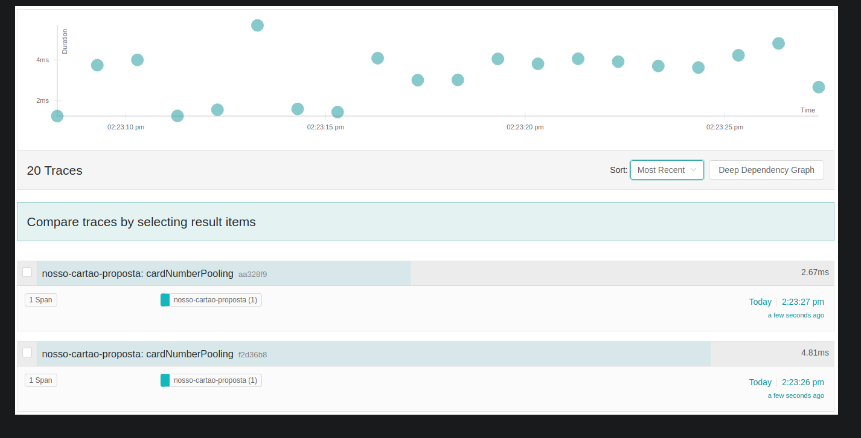

# Oauth

É um padrão de mercado de segurança e autenticação em API's REST
Usa o conceito de provedores de autenticação - delegar
autenticação à um serviço como google, github, facebook

### Entidades do OAuth2

São 4 entidades principais:

IAM - Identity and Access Management
Categoria de sistemas que trata de gerenciamento de perfis de
usuário.

Keycloak - manter dados dos usuários seguros
Integração ao Spring Framework. É Open Source

OAUTH resolve problemas de autenticação tradicionais:

* O servidor não mais tem que armazenar e gerenciar senhas de usuários
* O servidor não precisa se preocupar com duração da permissão de acesso
* introducing an authorization layer and separating the
role of the client from that of the resource owner
* Instead of using the resource owner's credentials to access protected
  resources, the client obtains an access token -- a string denoting a
  specific scope, lifetime, and other access attributes
* Basicamente o servidor dono dos recursos terceiriza o
acesso e credenciais para um provedor de autenticação
que usa um token.

### 1.1.  Roles

<b>OAuth defines four roles:</b>

#### resource owner
An entity capable of granting access to a protected resource.
When the resource owner is a person, it is referred to as an
end-user.

#### resource server
The server hosting the protected resources, capable of accepting
and responding to protected resource requests using access tokens.

#### client
An application making protected resource requests on behalf of the
resource owner and with its authorization.  The term "client" does
not imply any particular implementation characteristics (e.g.,
whether the application executes on a server, a desktop, or other
devices).

#### authorization server
The server issuing access tokens to the client after successfully
authenticating the resource owner and obtaining authorization.

> obs: The authorization server may be the same server as the resource
server or a separate entity. A single authorization server may issue 
access tokens accepted by multiple resource servers.

______________________________________________________________________________________________

# Keycloak 

Conceitos de Realms de autenticação

federated identity management (FIM) and single sign-on (SSO).

But first—it’s important that we understand the nuances of these solutions. 
How is FIM different from SSO? What are the ideal use cases for each approach? 

#### SSO
allows users to access multiple web applications at once, using just one set of
credentials. For businesses that deploy various applications for HR, payroll, and 
communications, an SSO solution allows employees to access each of those services 
with just one login. This makes it easier for users to do their job—as they no 
longer have to remember multiple passwords—and also reduces the amount of time 
IT spends on password resets.

Beyond the workforce, companies can utilize SSO to help customers access various 
sections of one account. For instance, retail networks with many brands can use SSO
to let customers access their accounts with each store from one central dashboard, 
enhancing their user experience. When shifting between each one, the site 
re-authenticates users with the same credentials.

#### Breaking down Federated Identity Management (FIM)
As a solution, FIM was developed as a set of agreements and standards that help 
enterprises and applications share user identities. Essentially, it’s an arrangement 
that can be made among multiple organizations so that subscribers can use the same 
identifiers to access various applications. In short, it’s what allows you to sign 
into Spotify with your Facebook account details. --> ### VIDE NOVA LGPD ###

Added to that, in a FIM system, the onus of reviewing and authenticating user 
credentials is with an identity provider (IdP), not the applications themselves. 
So, when a user attempts to log into a specific service provider (SP) or application,
the SP then communicates with the IdP to authenticate the user. This user identity 
authorization is often executed through open-sourced Security Assertion Markup 
Language (SAML), or other related standards like OAuth or OpenID Connect. 

### Diferenças

The key difference between SSO and FIM is while SSO is designed to authenticate a 
single credential across various systems within one organization,

federated identity management systems offer single access to a number of applications
across various enterprises. 

So, while SSO is a function of FIM, having SSO in place won’t necessarily allow for 
federated identity management. That said, both tools are crucial in supporting 
organizations with both securing their data and minimizing obstacles in user experience.

#### Resumindo:

**Single SignOn** é usado dentro de uma empresa para gerir acessos e permissões
de grupos, acesso à serviços e a informações dessa mesma empresa. Governança

**Federal Identity Manager** é usado para autenticar usuários comuns de várias empresas
à produtos, serviços e informações divididas por grupos.

#### Benefícios:

> Multi-factor authentication: Multi-factor authentication, or MFA, refers to the use of
more than one identity factor to authenticate a user (see What is MFA?). For example,
in addition to entering a username and password, a user might have to connect a USB
device or enter a code that appears on their smartphone. Possession of this physical
object is a second "factor" that establishes the user is who they say they are.
MFA is much more secure than relying on a password alone. SSO makes it possible
to activate MFA at a single point instead of having to activate it for three, four, or
several dozen apps, which may not be feasible.

> Internal credential management instead of external storage: Usually, user passwords 
are stored remotely in an unmanaged fashion by applications and services that may or
may not follow best security practices. With SSO, however, they are stored internally
in an environment that an IT team has more control over.

> An SSO service does not necessarily remember who a user is, since it does not store 
user identities. Most SSO services work by checking user credentials against a separate
identity management service.

> Think of SSO as a go-between that can confirm whether a user's login credentials match
with their identity in the database, without managing the database themselves — 
somewhat like when a librarian looks up a book on someone else's behalf based on the 
title of the book. The librarian does not have the entire library card catalog memorized,
but they can access it easily.

## Como SSO funciona?

The ability to pass an authentication token to external apps and services is crucial in 
the SSO process. This is what enables identity verification to take place separately from
other cloud services, making SSO possible.

Event staff can check the stamps of every guest to make sure they are allowed to be there. 
However, not just any stamp will do; event staff will know the exact shape and color of the
stamp used by the guards at the entrance.

Just as each stamp has to look the same, authentication tokens have their own communication
standards to ensure that they are correct and legitimate. The main authentication token 
standard is called **SAML (Security Assertion Markup Language)**. Similar to how webpages are
written in HTML (Hypertext Markup Language), authentication tokens are written in SAML.

## Como SSO se encaixa na estratégia de gerenciamento e acessos?

SSO is only one aspect of managing user access. It must be combined with access control,
permission control, activity logs, and other measures for tracking and controlling user
behavior within an organization's internal systems. SSO is a crucial element of access 
management, however. If a system does not know who a user is, there is no way to allow
or restrict that user's actions.

______________________________________________________________________________________________

# Métricas

Utilizamos métricas para troubleshooting e também para tomada de decisões, como por exemplo:

* Métricas de utilização de recurso computacional (CPU, Memória, Rede)
* Métricas de tempo de processamento de uma determinada funcionalidade
* Métricas de utilização de um determinado produto, como por exemplo: vendas onlines, 
físicas ou por terceiros.

Todo software tem que ter uma observabilidade, principalmente quando falamos de sistemas
distribuídos, pois pode crescer muito o mesmo, ter 100, 200 ou até mais aplicações sendo 
executadas gerando inúmeros cenários e inúmeros pontos de falha!

existem vários tipos de métricas para responder várias perguntas

* Métricas de infraestrutura, como por exemplo: CPU, memória, rede, etc.
* Métricas de negócio, como por exemplo: Quantidade de usuário, compras, vendas, 
conversão, etc.

arquitetura distribuída, como por exemplo Microsserviços, existe uma boa prática 
denominada RED, que tem como objetivo responder três perguntas e deve ser 
implementada em todos os serviços:

1) Rate: Quantidade de solicitações, por segundo, que seus serviços estão processando.
2) Errors: Quantidade de solicitações com falha por segundo.
3) Duration: Quantidade de tempo que cada solicitação leva.

> Ter essas métricas é extremamente importante e recomendado pela Zup, pois ajuda muito em 
troubleshooting de anomalias em nossos serviços, como por exemplo:
“Clientes estão reclamando que está muito lento a Transferência de TED e infelizmente o 
time de sustentação não consegue encontrar o problema, pois não tem métricas!”
“Foi solicitado para o time de desenvolvimento implementar as métricas RED e logo após 
a sua implementação e implantação em produção, ficou claro o problema!”
Por conta da mudança no mercado financeiro, a quantidade de solicitações por segundo 
cresceu muito e os serviços provisionados não conseguem suportar tal carga, ocasionando 
dois problemas:
Muitas requisições com falha por segundo, ocasionando uma péssima experiência para o 
usuário\cliente.

Spring Boot Actuator, quando configurado o endpoint de métricas, já implementa as 
métricas do tipo RED

    http_server_requests_seconds_count: Quantidade de requisições por segundo
    http_server_requests_seconds_sum: Quantidade de tempo por segundo

Para cálcular a quantidade que cada requisção leva 

    http_server_requests_seconds_sum \ http_server_requests_seconds_count

Para saber quais são sucesso ou erro as mesmas tem a label status, conforme exemplo abaixo:

    http_server_requests_seconds_count{method="POST",outcome="SUCCESS",status="201",uri="/v1/propostas",} 20.0
    
    http_server_requests_seconds_count{method="POST",outcome="CLIENT_ERROR",status="422",uri="/v1/propostas",} 5.0

## Os Quatro Sinais Dourados do monitoramento e métricas

Os quatro sinais de ouro de monitoramento são:
- latência,
- tráfego,
- erros
- saturação

Se você só pode medir quatro métricas de seu sistema voltado para o usuário,
concentre-se nessas quatro.

Empilhar todos esses requisitos uns sobre os outros pode resultar em um sistema de
monitoramento muito complexo - seu sistema pode acabar com os seguintes níveis de
complexidade:

1) Alertas em diferentes limites de latência, em diferentes percentis, em todos os tipos
   de métricas diferentes
2) Código extra para detectar e expor as possíveis causas
3) Painéis associados para cada uma dessas possíveis causas

* As regras que detectam incidentes reais na maioria das vezes devem ser o mais simples,
  previsíveis e confiáveis possível.
* A coleta de dados, agregação e configuração de alerta que raramente é exercida (por
  exemplo, menos de uma vez por trimestre para algumas equipes SRE) devem ser removidos.
* Os sinais que são coletados, mas não expostos em nenhum painel pré-elaborado nem usados
  por qualquer alerta, são candidatos à remoção.

______________________________________________________________________________________________

# Prometheus

O Prometheus é um sistema de monitoramento de código aberto baseado em métricas.

Prometheus faz uma coisa e faz bem. Ele possui um modelo de dados simples, porém poderoso, e uma 
linguagem de consulta que permite analisar o desempenho de seus aplicativos e infraestrutura.
O mesmo é escrito principalmente em Go e licenciado sob a licença Apache 2.0

Para instrumentar seu próprio código, existem bibliotecas em todas as linguagens populares, incluindo Go, Java, C#, 
Python, Ruby, Node.js, etc. Softwares como Kubernetes e Docker já estão instrumentados com as bibliotecas do Prometheus.

softwares de terceiros que expõem métricas em algum outro formato que não seja do Prometheus
são chamados de exportadores e incluem HAProxy, MySQL, PostgreSQL, Redis, JMX, SNMP, Consul e Kafka.

### Funcionalidades
PromQL, uma linguagem de consulta flexível para efetuar consultas.
A coleta de métricas ocorre por meio de um modelo pull sobre HTTP.
Receber métricas é suportado através de um gateway intermediário.

### Coleta de métricas
Existem dois modelos de coleta de métricas:

* Pull model
* Push model

#### Pull Model
o Prometheus tem a responsabilidade de coletar as métricas de acordo com os endereços configurados 
em seu arquivo de configuração, ou seja, se você configurou para ele coletar as métricas do endereço

    www.prd-servico-proposta.com.br/actuator/prometheus 
a cada 5s.

A sua aplicação não tem a responsabilidade de enviar as métricas e sim de apenas fornecer no formato 
Prometheus e o Prometheus irá coletar!

#### Push Model
é o menos utilizado, pois ele atende um cenário muito específico, como por exemplos operações de curta duração
Como essas operações duram pouco, seus endereços mudam bastante e fica inviável do Prometheus gerenciar isso, 
portanto a responsabilidade de enviar as métricas são da aplicação

Se você utiliza uma aplicação que roda horas, dias, meses, etc. Utilize o modelo de pull model e remova a 
complexidade da sua aplicação.

__________________________________________________________________________________________________

# Métricas no Spring Boot Actuator

Já sabemos que o Spring em conjunto com o Micrometer, suporta vários sistemas de monitoramento
de métrica, para habilitados, precisamos adicionar a dependência dos desejados, como por exemplo
o Prometheus!
Para habilitar um endpoint que exporta métrica no formato prometheus, precisamos adicionar a
seguinte dependência no arquivo pom.xml, conforme exemplo abaixo:

    <dependency>
      <groupId>io.micrometer</groupId>
      <artifactId>micrometer-registry-prometheus</artifactId>
    </dependency>

habilitar o endpoint /actuator/prometheus para isso, vamos adicionar a seguinte propriedade
no arquivo application.properties, conforme exemplo abaixo:

    management.endpoints.web.exposure.include=info,health,prometheus
    management.endpoints.prometheus.enabled=true

Para testar, basta abrir seu navegador e chamar o endereço

    http://localhost:8080/actuator/prometheus

a sua aplicação está pronta para ser monitorada
precisamos adicionar uma LABEL com o nome da aplicação e qual ambiente.

#### Formato de métrica do Prometheus

NAME é o nome da métrica, como por exemplo:

    proposta_criadas_total

LABEL é utilizado para diferenciar as características da métrica, como por exemplo:

    proposta_criadas_total{aplicacao="serviço de proposta", ambiente="desenvolvimento"}

Sabemos que essa métrica vem do serviço de proposta e do ambiente de desenvolvimento!

#### Importante
Cuidado com a quantidade de LABEL, quanto mais, mais irá aumentar os dados armazenados
no Prometheus, podendo causar problemas de performance e de disco.

vamos adicionar o nome da aplicação e o ambiente?
Para isto, o Spring provê uma forma simples e rápida via properties, conforme exemplo abaixo:

    management.metrics.tags.aplicacao=serviço de proposta
    management.metrics.tags.ambiente=desenvolvimento

Para testar, basta abrir seu navegador e chamar o endereço

    http://localhost:8080/actuator/prometheus

Sobre Labels

[Prometheus - Labels e Namming](https://prometheus.io/docs/practices/naming/)

E sobre monitoramento de sistemas distribuídos

[srcGoogle](https://sre.google/sre-book/monitoring-distributed-systems/#xref_monitoring_golden-signals)

#### Sobre variáveis de ambiente 
[The twelve Factor App](https://12factor.net/pt_br/)

[Fornecer Configuracao de serviços externos para a minha aplicação](https://docs.google.com/document/d/1nM20TMk4OdQtAf-FbBX6CuLQ0FvKgaxiNViTOF_pKRc/edit)

O Spring suporta a configuração das aplicações usando os arquivos *.properties ou *.yaml,
nesses arquivos podemos fazer referências às variáveis de ambiente.

    cartoes.host=${CARTOES_URL}
    cartoes:
    host: ${CARTOES_URL}   

Veja que em ambos os casos usamos o caractere "$" para indicar que aquela propriedade
deve ser resolvida com variáveis de ambiente.

#### Quero definir um valor padrão. É possível?

    cartoes.host=${CARTOES_URL:http://localhost:9999/api/cartoes}
    cartoes:
    host: ${CARTOES_URL:http://localhost:9999/api/cartoes}   

É possível notar que utilizamos : separando a variável de ambiente do valor default.

#### Dicas
Utilize valores default somente em contexto de desenvolvimento, essa prática não é recomendada para ambientes produtivos.

# Open Tracing

Surge como solução para problemas de troubleshooting em aplicações distribuídas (microsserviços) por ser difícil encontrar
a causa do problema (ver causas e sintomas)

Uma alternativa é coletar os logs de cada serviço e analisá-los. Num cenário onde temos poucos serviços isso parece 
viável, mas e quando tiver inúmeras instâncias desse um mesmo serviço sendo executadas? Imagina que no exemplo da figura 
acima tenhamos 5 instâncias de cada serviço. Logo, teríamos que coletar e analisar logs de 20 instâncias diferentes.

Soluções encontradas para melhorar a observabilidade dos nossos serviços:
* Trace
* Métricas
* Logs

foi criada a especificação do OpenTracing para tratar do pilar de Trace

    A ideia consiste em gerar metadados no início de cada operação para identificá-las, e propagá-los internamente entre 
    os serviços envolvidos na operação podendo ser utilizado quaisquer protocolos que implementam a especificação, 
    como por exemplo:
            
    HTTP | AMQP | RPC

Além de propagar os metadados os mesmos são enviados assíncronamente para uma ferramenta que os armazena e provendo 
funcionalidades, como por exemplo:

> Catálogo de serviços
  Filtros por serviços
  Catálogo de operações
  Filtros por metadados
  Filtros por data
  Filtros por duração
  Gráfico da operação

### Terminologia

#### Span
Span é um período que representa uma operação, como por exemplo, uma requisição HTTP, na qual contém metadados 
extremamente importantes, como:

* Nome da operação
* Início da operação
* Término da operação
* Tags do span\operação em si, como por exemplo: Nome do serviço, ip, método HTTP, etc.
* Baggages são pares de string para chave e valor que se aplicam ao Span, os quais se propagam em conjunto com o próprio
* rastreamento, como por exemplo: identificador do usuário.
* Logs do span\operação em si.

#### Trace

### OpenTracing Data Model

# Jaeger (open trace)

O Jaeger é uma implementação bastante famosa do Open Tracing, na qual é mantida pela Cloud 
Native Computing Foundation.

dependência em seu arquivo pom.xml:

      <dependency>
        <groupId>io.opentracing.contrib</groupId>
        <artifactId>opentracing-spring-jaeger-cloud-starter</artifactId>
        <version>3.2.2</version>
      </dependency>

no arquivo application.properties:

    # Jaeger - Habilita ou não
    opentracing.jaeger.enabled=${JAEGER_ENABLED:true}
    
    # Jaeger - Nome do serviço
    opentracing.jaeger.service-name=${spring.application.name}
    
    # Jaeger - Endereço para enviar os metadados (trace, span, etc)
    opentracing.jaeger.http-sender.url=${JAEGER_ENDPOINT:http://localhost:14268/api/traces}
    
    # Jaeger - Tipo de amostragem (probabilístico) e sua configuração (1 = 100%)
    opentracing.jaeger.probabilistic-sampler.sampling-rate=${JAEGER_SAMPLER:1}

#### Importante

Se a sua aplicação estiver travada no log "Triggering deferred initialization of Spring Data
repositories…", por favor, desabilite a configuração de OpenTracing para JDBC adicionando a
seguinte propriedade: 

    opentracing.spring.cloud.jdbc.enabled=false

o spring faz sua mágica, pois ele tem inúmeras configurações automáticas para vários módulos,
como por exemplo:

* Spring Web (RestControllers, RestTemplates, WebAsyncTask, WebClient, WebFlux)
* @Async, @Scheduled, Executors
* WebSocket STOMP
* Feign, HystrixFeign

* Hystrix | JMS | JDBC | Kafka | Mongo | Zuul | Reactor | RxJava | Redis

* Standard logging - logs are added to active span
* Spring Messaging - trace messages being sent through Messaging Channels
* RabbitMQ

Cada um desses módulos tem uma configuração automática, denominada AutoConfiguration, como
por exemplo, no código abaixo:

      @Configuration
      @AutoConfigureAfter({TracerRegisterAutoConfiguration.class, org.springframework.boot.autoconfigure.data.redis.RedisAutoConfiguration.class})
      @ConditionalOnBean(RedisConnectionFactory.class)
      @ConditionalOnProperty(name = "opentracing.spring.cloud.redis.enabled", havingValue = "true", matchIfMissing = true)
      @EnableConfigurationProperties(RedisTracingProperties.class)
      public class RedisAutoConfiguration {

      @Bean
      public RedisAspect openTracingRedisAspect(Tracer tracer, RedisTracingProperties properties) {
      return new RedisAspect(tracer, properties);
        }
      }

No código acima se na sua aplicação tiver um objeto RedisConnectionFactory ele irá injetar no contexto de injeção de 
dependência do Spring o RedisAspect que irá executar antes e após a cada operação dessa tecnologia, adicionando
as informações necessárias da mesma no span do OpenTracing.

Agora podemos olhar o mesmo comportamento no código do Feign, que é uma biblioteca muito famosa para realização de integrações com outros serviços, principalmente via HTTP.
    
    @Configuration
    @ConditionalOnClass(Client.class)
    @ConditionalOnBean(Tracer.class)
    @AutoConfigureAfter(TracerAutoConfiguration.class)
    @AutoConfigureBefore(name = "org.springframework.cloud.openfeign.FeignAutoConfiguration")
    @ConditionalOnProperty(name = "opentracing.spring.cloud.feign.enabled", havingValue = "true", matchIfMissing = true)
    public class FeignTracingAutoConfiguration {
    ...
    
    @Bean
    public TracingAspect tracingAspect() {
      return new TracingAspect();
      }
    }

Perceba que tem o uso da annotation ConditionalOnProperty para verificar se a implementação
de open tracing está habilitada para o Feign. Caso não exista nenhuma configuração explícita,
o trace é habilitado por default por conta do argumento 
    
    matchIfMissing = true 
presente na annotation.

Para testar precisamos verificar se o Jaeger foi iniciado, conforme está no docker-compose, 
para isto, vamos abrir em nosso navegador favorito o endereço **http://localhost:16686/search**

Selecione o nome do serviço e clique em Find Traces, logo após irá listar os traces do 
lado direito, conforme imagem abaixo:

#### Dicas

Explore a ferramenta ao máximo, assim você conseguirá no futuro utilizar a mesma da melhorar
maneira, como por exemplo:

- Filtrar por erro, tags, operação, duração, etc.
- Analisar os spans, como tempo, latência de redes, tags, logs, etc.
- Analisar as integrações.

